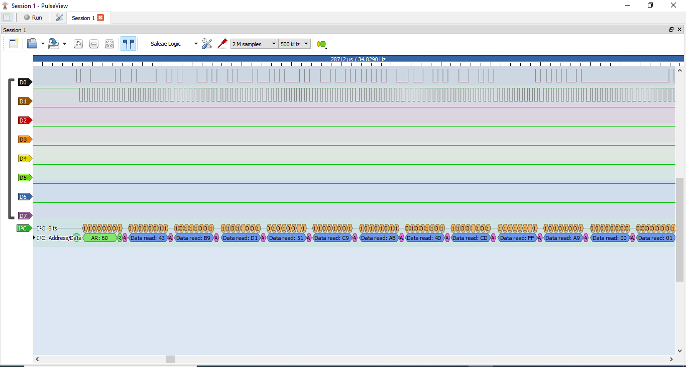
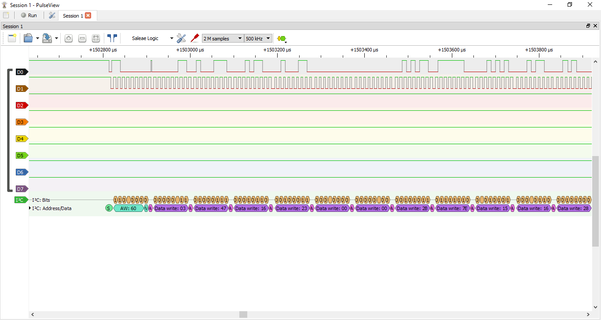
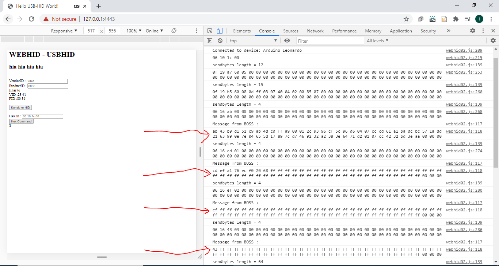
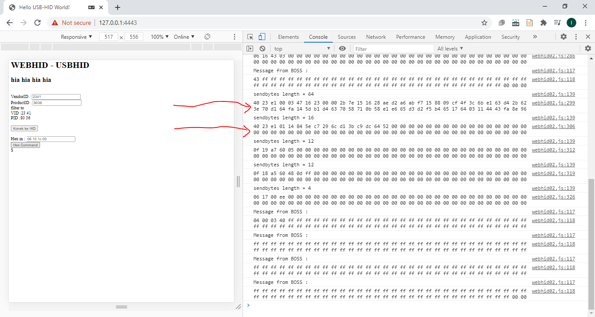

## Akses WEBHID ke I2C device menggunakan USB HID (RawHID), Arduino Pro Micro
## dengan Kirim-Terima lebih dari 64 byte.

  

modul yang saya gunakan : Arduino Pro Micro

## Latar belakang:
pengalaman mengakses I2C device menggunakan interface USB. Karena dengan menggunakan USB, 
implementasi I2C device tidak perlu "membongkar" perangkat Host (antara lain solder langsung ke mother board), 
serta saat ini konektivitas USB banyak diterapkan pada perangkat PC/SBC/USB-OTG-smartphone.
Dan sedang dikembangkan fitur WEBHID untuk akses USB-HID, dan telah saya uji coba di
https://github.com/irvankris/simple-WEBHID-Arduino-Pro-Micro

## tantangan:
dalam standard USB-HID, maksimum kirim-terima data adalah 64 byte. Padahal terkadang kita memerlukan kirim terima data lebih dari 64 byte.
dari project WEBHID sebelumnya, saya belum berhasil kirim terima data lebih dari 64 byte pada HID menggunakan Arduino Pro Micro ATMega32u4

## Titik terang ... 
Saya telah berhasil akses USB-HID MCP2221A, untuk kirim-terima I2C data lebih dari 64byte.
https://github.com/irvankris/MCP2221A-more-than-64Byte, jadi kirim-terima I2C data lebih dari 64byte melalui USB-HID adalah sangat mungkin.

Berikut ini adalah hasil Signal Capture kirim dan terima data I2C lebih dari 64Byte.
pada file readnwrite_more_than_60_bytes_signal.sr

hasil capture logic analyzer dapat dibuka menggunakan aplikasi PulseView.

Signal saat terima/baca dari I2C Device :

  

Signal saat kirim/tulis ke I2C Device

  

dan User Interface WEBHID, relatif sama dengan project sebelumnya https://github.com/irvankris/simple-WEBHID-Arduino-Pro-Micro , dan untuk menjalankan WEBHID dapat membaca project itu.

Berikut ini adalah hasil console-log saat eksekusi kirim-terima I2C data lebih dari 64Bytes

log saat terima/baca dari I2C Device :

  

log saat kirim/tulis data2 ke Arduino Pro Micro, simpan di buffer (data preparing), sebelum dikirim ke I2C Device

  

 
adanya fitur WEBHID dengan kemampuan kirim terima data I2C lebih dari 64byte, maka dapat menginspirasi integrasi antara aplikasi Web-Based dengan I2C device yang lebih kompleks.

Semoga bermanfaat.

## License
The MIT License (MIT) Copyright (c) 2021 Irvan Kristianto (irvan.kristianto@gmail.com)

